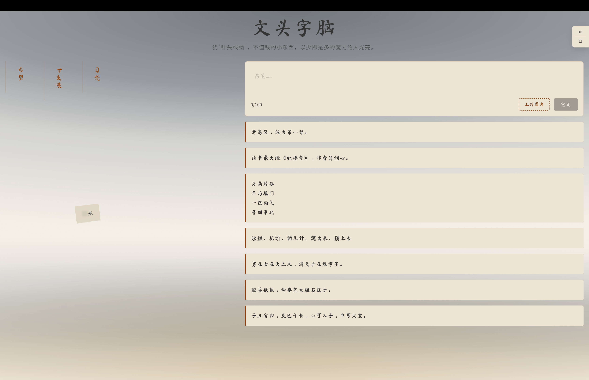

# 文头字脑

一个生在贫困山区的少年，很难看到像样的读物，甚至连纸都很少见，有时候在路上捡到撕得零星的报纸，会如获至宝，痴痴阅读。第一次看到烟盒上的"廿支装"，问了爸爸知道了那个"廿"字的读音和含义。新学期领了新书是最幸福的时候，会在油墨香中一天内看完所有课文，即使有字不认识，也不会成为障碍，反而会有些美丽的误会，正如诗歌里的意境章句，准确明白的解释并不如原句那样朦胧美。慢慢长大，发现不是所有说普通话的人都优美，实际上很多人不纯粹，语言无味、面目可憎；发现不是所有书都好，有的确实可称垃圾。再后来，经历了手机媒体信息泛滥，越发怀念小时物质贫乏、文字有限时的境况。



## 如何运行

### macOS
双击 `build/bin/文头字脑.app`

### 开发模式
```bash
wails dev
```

### 构建
```bash
wails build
```

## 如何游玩

1. **探索场景**：随机出现若干文字碎片
2. **点击碎片**：查看详情，阅读主角的片段回忆
3. **收入囊中**：点击"收集"，碎片进入收集栏，触发叙事
4. **叙事展开**：随着碎片收集，主角的故事逐渐浮现；点击已收集碎片可再次查看
5. **自由创作**：在创作区写下你的字，或上传一张图片
6. **惜字如金**：每个创作都会永久保存

## 核心设计

- **美丽的误会**：文字碎片有磨损，解读权归你——没有正确答案
- **惜字如金**：文字稀疏珍贵，每个字都有分量
- **清空重来**：随时可清空，重置碎片池
- **自由创作**：完全开放的内容创作，无评判，无标准答案
- **本地存档**：所有数据存在本地，不上传到任何服务器

## 技术架构

```
前端（Web）
├── HTML5 + CSS3 + TypeScript（Vite 构建）
├── Web Audio API 合成音效
├── Terser 代码压缩/混淆
└── @fontsource 字体（Noto Sans SC + Ma Shan Zheng）

后端（Go / Wails）
├── SQLite 数据库（~/.still/still.db）
├── 分页加载
└── 原生 App 打包
```

## 数据存储

```
~/.still/
└── still.db           # SQLite 数据库
```

- **collected/**：每收集一个碎片创建一个 JSON 文件
- **creations/**：每篇创作一个 HTML 文件（含 base64 图片）
- 无需服务器，纯本地存储
- 可直接复制 ~/.still 目录备份

## 文件说明

```
.
├── app.go               # Go 后端（存储、碎片逻辑）
├── main.go              # Wails 入口
├── frontend/
│   ├── index.html       # 游戏主页面
│   ├── vite.config.ts   # Vite 构建配置
│   ├── tsconfig.json    # TypeScript 配置
│   └── src/
│       ├── main.ts      # 游戏逻辑（TypeScript）
│       └── style.css    # 样式
└── build/bin/
    └── 文头字脑.app     # macOS 应用
```

## 运行要求

- macOS（当前构建目标）
- 无需浏览器（原生 App）
- 数据存储在 ~/.still 目录

## 音效说明

所有音效均为 Web Audio API 程序合成，无外部依赖。静音按钮位于页面右上角。

## 关于

文头字脑 · 2026
灵感来自贫困山村中那些珍贵的文字碎片。
